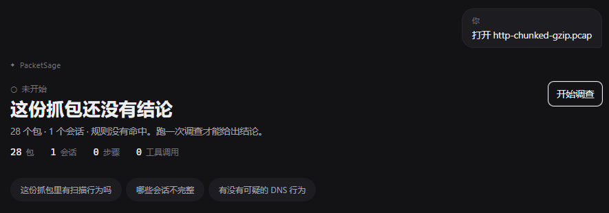
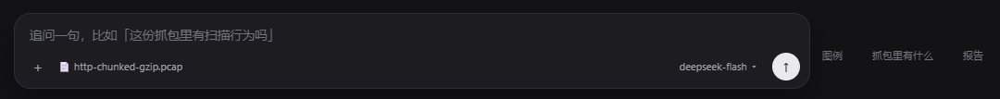
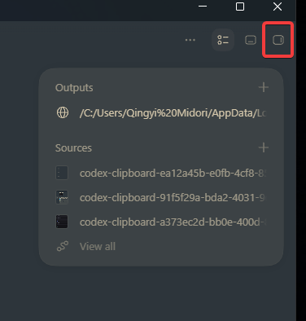
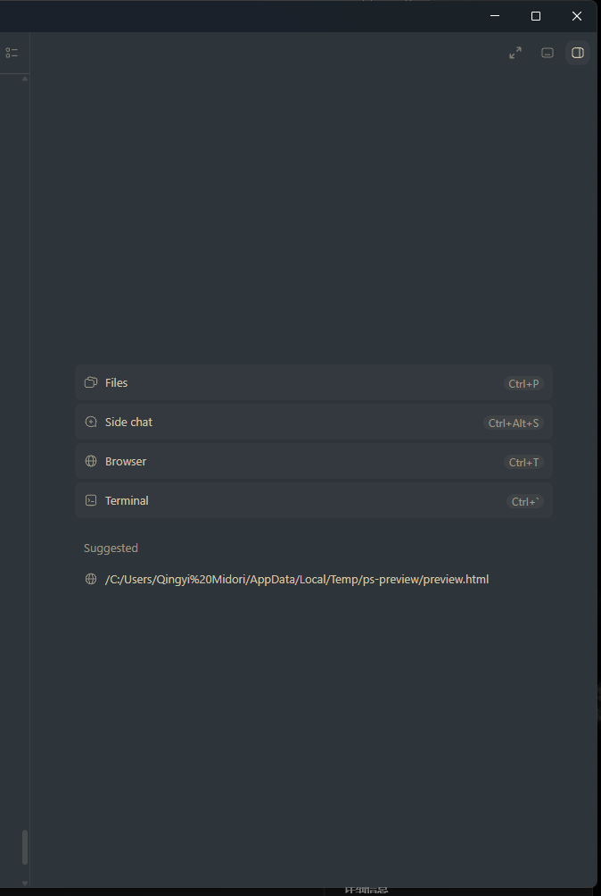

# GUI 待修问题（2026-09-22 实测记录）

> 状态：**已修（2026-09-23），真机验收通过**。结论在下面「修复结果」一节；现象与根因保留原文，
> 方便回看当时是怎么定位的。规格条目已按结论改写（§5.1.1 第 22 条定稿，新增第 25、26 条）。
>
> 截图放在 `docs/ui/issues-2026-09-22/`（从临时目录搬进来的，临时文件会被系统清掉）；
> **测试记录与验收材料本地留存、不进版本库**（见根 `.gitignore`，2026-09-23 用户要求）。
> 相关规格条目：《GUI 工程规格书 v0.2》§5.1.1 第 22 条（胶囊）与第 23 条（左栏历史对话）。

---

## 修复结果（2026-09-23）

代码改动集中在 `desktop/src/App.tsx` 与 `desktop/src/styles.css`（前端布局与状态机），
引擎 / sidecar / 协议一行没动。修完的截图在 `docs/ui/fixes-2026-09-23/`。

**1 · 打开抓包不再多出一轮**（第 25 条）：`analyzePath()` / `openTask()` 里的
`setAsked("打开 …")` 删掉，`liveTurnId` 只由 `startInvestigation()` 设；会话流里
「用户那一句 + Agent 这一段」整体改成 `liveTurn ? … : …`，空态（"还没有结论" /
"规则命中 N 条告警，还没做调查" + 建议问题 + `开始调查`）改由**当前抓包**渲染。
切到一份跑过调查的抓包时，空态写成「这份抓包有 N 轮调查记录」，不再喊"还没结论"。
顺手把 `openTask()` 里漏掉的 `budgetState / timings / cache` 复位补上（否则空态会显示
上一份抓包的步骤数）。
**验收**（mock provider 真跑一遍）：连开 synth-mixed / synth-portscan / synth-synflood
再切回第一份 —— 只是空态，没有「打开 XXX」；跑一次 `开始调查` + 一次追问后左栏
「历史对话 · 2」，会话流里正好 2 轮（`docs/ui/fixes-2026-09-23/06-history-two-turns.png`）。

**2 + 3 · 胶囊作废，次要信息进右栏**（第 22 条定稿）：`.composer-tools` / `.pill-btn` /
`.tool-panel` 三块 CSS 与对应 JSX 一起删掉，输入框那一带只剩 `＋ / 抓包名 / 模型 ▾ / 发送`；
v0.4 的报告坞（`.main.docked` + `.dock`）推广成**通用右栏**，栏头三个页签：
`抓包里有什么` / `图例` / `报告`（生成后显示「报告 · 已生成」）。入口在顶栏：
**方框图标**开合（记住了上次看的那一栏）+ **`＋` 菜单**选内容。
**踩到的坑**：`＋` 菜单第一版挂在 `.topbar` 里，顶栏为了让标题省略号必须
`overflow: hidden`，菜单被整块裁掉（看着像"点了没反应"）——挂到 `.main` 上就好了。
滚轮在输入框旁边的空白处仍能滚会话流（`.composer-wrap { pointer-events: none }` 没动，
实测滚 10 格后画面确实滚了）。
**验收**：右栏宽度与报告坞一致（同一个 `.dock`）；切到「抓包里有什么」有 612 包 / 570 会话 /
2 条规则告警的统计与按窗口列出的告警明细；「图例」出四层输出 + 严重度色阶；「报告」能生成
并就地渲染九节正文；`✕` 收起、方框图标再打开回到原栏。

**4 · 顺手补的一条**（第 26 条，验收时才发现，原记录里没有）：在向导里配好模型（= 主动重启
Agent）之后，界面挂着「Agent 已退出（无退出码）」横幅 + 「调查没能完成」的红色结论——
外壳给**真崩溃**和**主动重启**发的是同一条 `sidecar-exited`，前端分不出来。现在向导保存、
输入框的「保存并重启 Agent」、左栏「重建 Agent」三条路径都先立 20 s 免罪窗口，
重启期间不再把界面打成 failed。实测：保存后只剩一行「已切到 mock，Agent 已重启。」。

**没有改的东西**（留给下一轮）：左栏「历史对话」的排序/聚合逻辑（第 23 条）没动；
历史仍然只存在本机 `localStorage`（跨机器要引擎加列，登记为缺口）。

### 回归

| 命令 | 结果 |
|---|---|
| `npm run build`（desktop） | 通过（tsc + vite） |
| `python -m pytest -q` | 179 passed |
| `cargo test`（desktop/src-tauri） | 单元 13 passed、`packaged_sidecars` 3 passed |
| `cargo test --test sidecar_smoke` | **本机跑不了**：测试 exe 一链接出来就被本机安全策略删掉 / 拒绝执行（`os error 5`；`target/debug/deps` 里只剩 `.d`/`.pdb`，9-22 那次也一样）。与前端的改动无关，待换台机器或用排除项验证 |
| `tests/sidecar/protocol_cases.py` | 8/8 |
| `tests/cli/gui_contract.py` | 7/7 |
| `tests/cli/exit_codes.py` | 43/43 |
| `scripts/build_desktop.ps1`（= `npm run tauri build`） | 通过：`packetsage-desktop.exe` + `PacketSage_0.1.0_x64-setup.exe` |

## 1 · 每次打开抓包都会多出一轮"打开 XXX"，只在第一次显示就够

**现象**：每次打开（或切到）一份抓包，会话流里就出现一轮：用户气泡「打开 http-chunked-gzip.pcap」
→ PacketSage → Hero「这份抓包还没有结论 / 28 个包 · 1 个会话 · 规则没有命中…」+ 三个建议问题。
打开十次就多十轮，**没有信息量**，还把真正的对话顶下去。

**已定位的根因**：`analyzePath()` 与 `openTask()` 都会
`setAsked("打开 <文件名>…")`，同时建一个 live turn（`liveTurnId`），于是渲染器把"这一轮"
当成一次对话画了出来；而它既没有 run 也没有 chat，Hero 只能落在"还没有结论"的空态。

**建议修法**（明天定）：

* 打开抓包**不建 turn**：`asked` / `liveTurnId` 只在真正发起 run / chat 时设置；
* 空态（"还没有结论"+ 建议问题）由**当前抓包**渲染，而不是由"一轮对话"渲染；
* 这样"打开抓包"就只剩下顶栏的文件名 + 空态，切来切去也不留痕。

**验收**：连续打开三份抓包再切回第一份，会话流里出现的轮次数 == 真正跑过的 run/chat 次数。

---

## 2 · 图例 / 抓包里有什么 / 报告 跑到输入框**右边**了，而且点不动

**现象**：三个胶囊没有落在输入框下面，而是被排到输入框**右侧**（竖向居中），
且点击没有任何反应。

**已定位的根因**（两处，都在 v0.9 那次改动里）：

1. **布局**：`.composer-wrap` 是 `display:flex; justify-content:center`，而我把
   `.composer-tools` 写成了 `<form class="composer">` 的**兄弟节点** → 它被当成第二个
   flex item，排在输入框右边。应该放进 form 内部（composer 是 column 布局），
   或者给 wrap 改成 `flex-direction: column; align-items: center`。
2. **点不动**：`.composer-wrap { pointer-events: none }`（当初是为了让输入框外的渐变区域
   把滚轮事件透给会话流），而胶囊没有单独 `pointer-events: auto` → 点击落不到它身上。
   同类问题提示：**任何加进 composer 区域的可点元素都必须显式写 `pointer-events: auto`**。

**验收**：三个胶囊在输入框正下方一行；点「图例」弹出面板、点第二次收起；
滚轮在胶囊旁边的空白处仍然能滚会话流。

---

## 3 · 「抓包里有什么」应该像 Codex 那样放在**右栏**

**现象/诉求**：`抓包里有什么`（以及同族的"图例 / 报告"）不该挤在输入框那一带，
应当做成 Codex 那样的**右侧面板**：右侧一条可开关的栏，栏里可以是多个来源
（Codex 的 `+` 菜单：Files / Side chat / Browser / Terminal；底部还列 Suggested 站点）。

**建议修法**：

* 复用已有的**报告坞**（`.main.docked` + `.dock`，v0.4 就做好了）：把它推广成
  **通用右栏**，内容可切：`抓包里有什么` / `报告` / 以后的 `证据台账`；
* 顶栏或会话流右上角给一个开关按钮（Codex 是右上角那个方框图标），
  再加一个 `+` 菜单列可选内容；
* 输入框那一带只留：`＋ 打开抓包`、当前抓包名、模型 ▾、发送 / 停止。
  **胶囊要么去掉、要么收进右栏的菜单**（问题 2 修好之前不要留着半吊子版本）。

**验收**：右栏可开关、宽度与报告坞一致；切到「抓包里有什么」时能看到统计 + 规则告警明细
（就是现在 `CaptureOverview` + `AlertRow` 那两块）；会话流不再有任何"抓包里有什么"的折叠块。

---

## 附：修完之后要顺手做的

* 《GUI 工程规格书 v0.2》§5.1.1 第 22 条要按上面的结论改写（"胶囊"这个中间形态大概率作废，
  直接写成"次要信息进右栏"）。
* 重新跑一遍：`npm run build`、`pytest -q`、`desktop/src-tauri → cargo test`、
  `tests/sidecar/protocol_cases.py`、`tests/cli/gui_contract.py`、`tests/cli/exit_codes.py`，
  再 `scripts\build_desktop.ps1` 重打 sidecar + exe + 安装包。
* 真机验收（M6 那一类）：连续开抓包 / 切抓包 / 追问一轮，确认会话流不涨空轮次、
  右栏能开关、输入框区域只剩它该有的东西。
